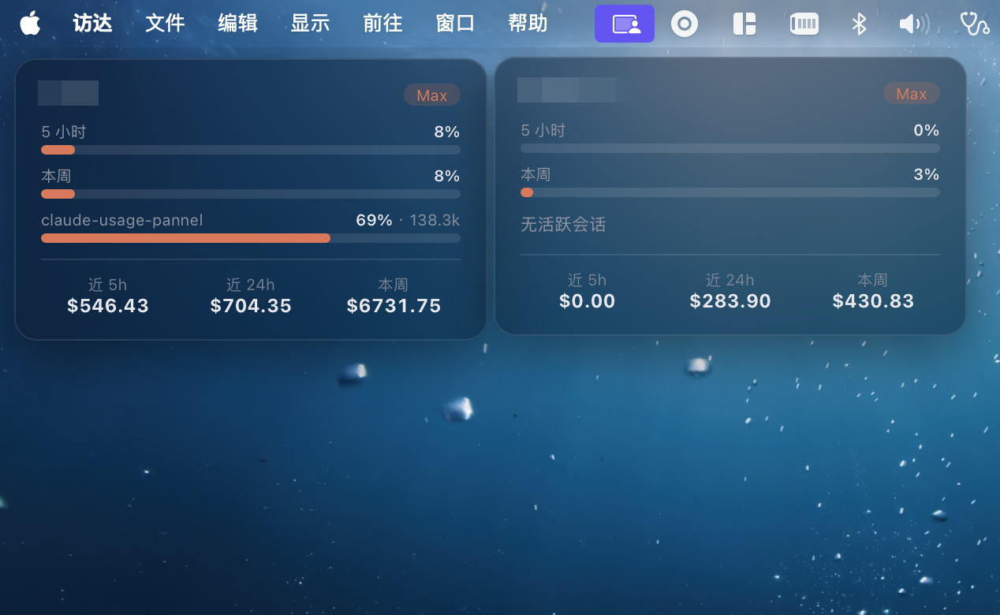

# claude-usage

本地 HTTP 面板，展示已登录 Claude 账号的官方 **5h / 周用量**、**当前活跃会话的 Context 占用**，以及**按滚动窗口（近 5h / 24h / 本周）估算的成本**。支持通过 SSH 聚合多台主机。



## 数据来源

- **官方额度**：`GET https://api.anthropic.com/api/oauth/usage`，用本机 OAuth 凭证（macOS 钥匙串 `Claude Code-credentials` 或 `~/.claude/.credentials.json`）。token 仅在本机使用，**不下发前端、不经聚合端传输、不写日志**。结果按 **5 分钟跨进程缓存**（落盘 `~/.config/claude-usage/usage-cache.json`，仅存利用率%）——daemon/CLI/远端 SSH 各是独立进程，共享此缓存以避免 429 限流。
- **会话 / 成本**：解析 `~/.claude/projects/**/*.jsonl`，无需凭证。
  - 当前 Context ≈ 最近一条 assistant 消息的 `input + cache_read + cache_creation`。
  - 成本按每条消息 `timestamp` 分入近 5h / 24h / 7d 滚动窗口，× 模型单价（`src/pricing.ts`，**近似可改**）。

## 运行

```bash
npm install
npm run dev        # 起面板 → http://127.0.0.1:4317
npm run collect    # 调试：打印本机一份 HostSnapshot
```

## 配置

复制 `hosts.example.json` 到 `~/.config/claude-usage/hosts.json` 后编辑（不存在时默认仅本机）：

| 字段 | 说明 |
|---|---|
| `port` | 监听端口（仅绑 127.0.0.1） |
| `pollSeconds` | 前端轮询间隔 |
| `activeWindowSeconds` | JSONL mtime 在此窗口内视为活跃会话（默认 300） |
| `contextWindow` | `0`=自动推断窗口大小；填 `1000000` 可强制按 1M 算占用百分比 |
| `remoteCacheSeconds` | 远端 SSH 快照缓存秒数 |
| `hosts[]` | `{name,type:'local'\|'ssh',ssh:'user@host 或 ssh 别名'}` |

## 上下文窗口推断

transcript 不记录窗口大小（Claude Code 仅在 statusline 的 stdin 里给 `context_window.context_window_size`），故按优先级：**配置覆盖 > 观测峰值>20万(物理溢出) > statusline 记录的精确值 > model 含 `[1m]` > 默认 20 万**。Token 数始终精确；仅"百分比"依赖此推断。

### 精确窗口：statusline 记录器（推荐）

要彻底判准（尤其「用量还没到 20 万的 1M 会话」），用本项目自带的 statusline 记录器：它在每次 statusline 刷新时抓 stdin 的 `context_window_size`，按 `session_id` 写到 `~/.config/claude-usage/context-cache/`，面板优先读它。**自包含，不依赖 claude-hud**；读不到则回退上面的启发式。

- 本机：`bash statusline/install-local.sh`
- 远端（每台 SSH 主机各跑一次）：`bash statusline/install-remote.sh <host>` —— 远端 collector 在远端执行、读远端缓存，故远端也需安装

两者都是**透传包裹**你现有的 statusLine（先备份 `~/.claude/settings.json.cu-bak`，原命令存进 `statusline.orig-command.txt`），不影响原 HUD/claude-hud。还原：`cp ~/.claude/settings.json.cu-bak ~/.claude/settings.json`。

## 桌面卡片 (Übersicht)

把面板做成贴在 macOS 桌面壁纸层的小卡片，瘦客户端 `curl` 取本地服务数据。

1. 装 Übersicht：`brew install --cask ubersicht`
2. 部署 widget：把 `ubersicht/claude-usage.widget/` 拷到 `~/Library/Application Support/Übersicht/widgets/`
3. 让服务常驻（开机自启）：把 `launchd/com.lxz.claude-usage.plist` 拷到 `~/Library/LaunchAgents/` 并 `launchctl load -w`。
   - 注意 plist 里的 `node` 与项目路径是**绝对路径**（本机 nvm），换机/升级 node 需同步修改。
   - 需先 `npm run build`（生成 `dist/` 与 `collector.bundle.cjs`）。
4. 启动 Übersicht（首次需 Gatekeeper 放行），卡片出现在桌面右上角，每 5s 刷新。

### 卡片：每主机独立 + 可拖拽

每台主机渲染成**一张独立卡片**。支持**拖拽移动**：按住卡片拖到任意位置即可，位置按主机名记进 widget 的 `localStorage`，刷新/重启都保留（Übersicht 本身无原生拖拽，由 `index.jsx` 内 window 事件委托实现）。卡片样式在 `index.jsx` 的 `className` 里调；默认初始排布（沿屏幕右侧竖向依次排开）在 `loadPos()` 里调。

### 毛玻璃（需屏幕录制权限）

卡片用 `backdrop-filter: blur(18px) saturate(1.3)` + 半透明背景。要让它**真正糊到壁纸**，须给 Übersicht 授予**屏幕录制**权限：系统设置 → 隐私与安全性 → 屏幕录制 → 打开 Übersicht（按提示退出并重开）。这是 macOS 隐私机制——未授权的 app「只能看到壁纸/自身」，Übersicht 需该权限把壁纸采进来当 backdrop 底。**不授权**则退化为半透明深色块（仍有玻璃感，但糊不到壁纸），并非 bug。

## 多主机 (SSH)

聚合端对每个 `ssh` 主机执行 `ssh <host> 'node - ...'`，把打包好的 `collector.bundle.cjs` 经 stdin 注入远端 node 执行，只回传算好的快照。

- 远端零安装，只需有 `node`，复用你的 `~/.ssh/config` / 密钥 / agent。
- **远端 macOS**：非交互 SSH 会话钥匙串常被锁 → 该主机 `account` 降级显示（`keychain-locked`），但会话/成本仍正常（不依赖凭证）。
- 远端 Linux：直读 `~/.claude/.credentials.json`，无此问题。
